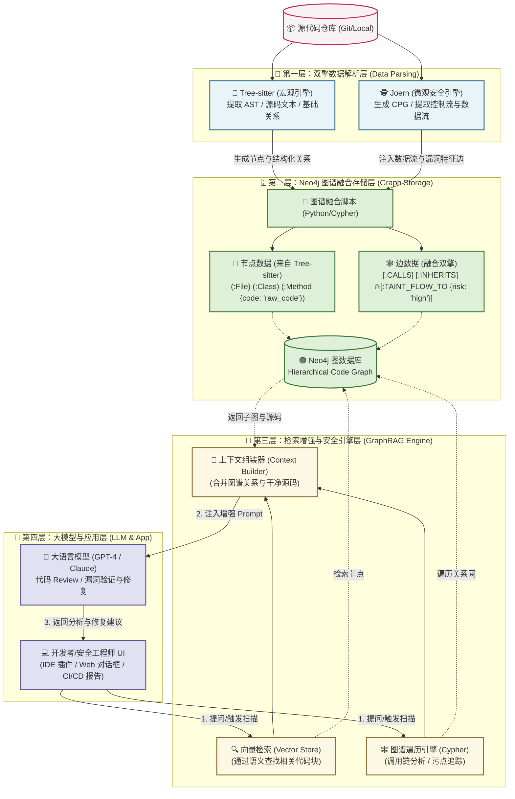

@../../core/cagr_processor/embedding_worker/ 这个模块现在直接写的qdrant_client 类进行向量数据库操作，这种写法太简单了， 我现在需要按照一下要求完成，
    1. 这个模块能扩展不同的向量数据库
        定义这么一个接口 VectorDatabase，其中包括一下功能(方法)
        createCollection
        createHybridCollection
        dropCollection
        hasCollection
        listCollections 
        insert
        insertHybrid
        search
        hybridSearch
        delete
        query
        checkCollectionLimit
    2. 你可以自己定义这些方法需要的参数和返回值的model
    3. 这个模块你要实现两个向量数据库的支持， qdrant和milvus， 实现中一定不允许存在固定的字符串，比如需要一下链接url，username， password 使用config类进行传递
    4. 写实现的时候注意性能和一些异常情况的考虑
这次的代码都要在这个模块内完成


第一步： 语法解析与关系提取
引擎1:（Tree-sitter) —— 提取代码的“骨架与肌肉”
本质：宏观结构分析（AST 层级）。
提取内容：项目包含哪些文件？文件里有哪些类？类有哪些方法？方法里的源码长什么样？基本的函数调用关系（A调用B）。
引擎2: 提取代码的“神经和血管”
本质：微观语义分析（控制流 CFG + 数据流 PDG）。
提取内容：变量在内存中怎么传递（污点追踪）？if-else 分支的执行路径是什么？
优势：它是为找漏洞而生的。自带强大的污点分析能力，能精准抓取数据流向危险函数的路径。
劣势：生成的图谱极其庞大且非常细碎。它会把一行代码拆成几十个底层节点（连一个 + 号都是一个节点）。如果你把这堆底层节点喂给大模型，大模型会瞬间“精神分裂”甚至上下文超载（Token 爆炸）。

两种引擎融合在同一个 Neo4j 数据库中的。
你可以采用**“分层图谱 (Hierarchical Graph)”**的设计方案：
宏观层（用 Tree-sitter 生成）：
将类、方法、文件存入 Neo4j。每个方法节点上，挂载完整的源码文本。这些节点主要服务于 LLM 的检索和阅读。
微观层（用 Joern 分析）：
让 Joern 在后台跑数据流分析（Data-flow），找出哪些函数之间存在“危险的数据传递”。
桥接融合（在 Neo4j 中打通）：
当 Joern 发现 Method_A 的某个恶意输入能流向 Method_B 时，你用 Python 脚本在 Neo4j 中，给这宏观层的这两个方法节点之间，动态添加一条边：[:TAINT_FLOW_TO {risk: "High"}]。

架构图

第二步：
图数据库建模与 Neo4j 存储 (Graph Modeling & Storage)
使用官方的 neo4j Python 驱动，将提取的数据批量写入数据库。
1. 推荐的图谱骨架设计 (Schema)：
节点 (Nodes)：
(:Project {name, version})
(:File {path, content}) (注意：代码原始内容作为属性存入，方便后续提取给 LLM)
(:Class {name, docstring})
(:Function/Method {name, signature, body, start_line, end_line})
(:Variable {name, type})
关系 (Relationships)：
(:Project)-[:CONTAINS]->(:File)
(:File)-[:DEFINES]->(:Class|:Function)
(:Class)-[:HAS_METHOD]->(:Function)
(:Function)-[:CALLS]->(:Function) (最重要的函数调用链)
(:Function)-[:READS|:WRITES]->(:Variable)
(:Function)-[:TAINT_FLOW_TO {risk: "High"}] (发现 Method_A 的某个恶意输入能流向 Method_B)
2. 写入策略： 
在 Python 中不要一条一条执行 Cypher。请使用 UNWIND 语句配合批量传递字典列表，以提升几百倍的导入速度。

第三步： 代码 Review 与漏洞发现 (Security & Review Engine)
数据存入 Neo4j 后，漏洞发现就变成了写 Cypher 语句做图遍历。

危险函数调用追踪（Sink 分析）：
你想知道哪些自己写的业务逻辑最终调用了危险系统函数（比如 eval 或 os.system）：
*   **危险函数调用追踪（Sink 分析）**：
    你想知道哪些自己写的业务逻辑最终调用了危险系统函数（比如 `eval` 或 `os.system`）：
    ```cypher
    // 查找从任意函数到危险函数的最短调用路径
    MATCH path = shortestPath(
      (f1:Function)-[:CALLS*1..5]->(f2:Function {name: "os.system"})
    )
    RETURN path
    ```
*   **权限绕过 / 未鉴权漏洞发现**：
    查找作为 API 入口点的函数（如标注了 `@app.route` 的节点），检查它的调用链路中，是否**缺失**了鉴权函数（如 `check_auth()`）：
    ```cypher
    MATCH (api:Function {is_endpoint: true})
    WHERE NOT (api)-[:CALLS*1..3]->(:Function {name: "check_auth"})
    RETURN api.name AS VulnerableAPI
    ```

---

### 第四阶段：大模型上下文提取 (LLM Context & GraphRAG)

这是该框架最迷人的部分。传统的 RAG 是把代码切成块做向量搜索，会导致 LLM 丢失“谁调用了谁”的全局视野。用 Neo4j，你可以给 LLM 提供立体的上下文。

**工作流**：
1.  **用户提问**：“`login_user` 函数存在越权漏洞吗？它依赖了哪些模块？”
2.  **向量检索 + 图检索 (Python 端实现)**：
    *   根据提问，在图谱中定位到 `(:Function {name: "login_user"})` 节点。
    *   使用 Cypher 获取“邻接子图”（Sub-graph）：该函数的源码 (自身属性)、它调用的下游函数源码 (1度外向关系)、调用它的上游控制器 (1度内向关系)。
3.  **拼装 Prompt 发给大模型**：
    通过 Python 提取 Neo4j 的查询结果，组装给 LLM：
    ```text
    你是一个安全审计专家，请分析目标代码及其上下文是否存在漏洞：

    【目标代码: login_user】
    def login_user(req): ...

    【它调用的下游函数实现】
    - fetch_db(query): ...

    【调用它的上游函数】
    - api_login(): ...

    请结合以上完整的调用链，分析...
    ```
**编写代码注意职责单一性和扩展性，比如现在虽然只只支持noe4j,但是你写代码的时候考虑可以方便扩展到其他的图数据库**    
代码编写结构：
这个模块下写neo4j 操作相关内容
/Users/wufagang/project/aiopen/code-omnigraph/core/cagr_processor/graph_builder
代码解析在这个模块下完成
/Users/wufagang/project/aiopen/code-omnigraph/core/cagr_collector/static_analyzer